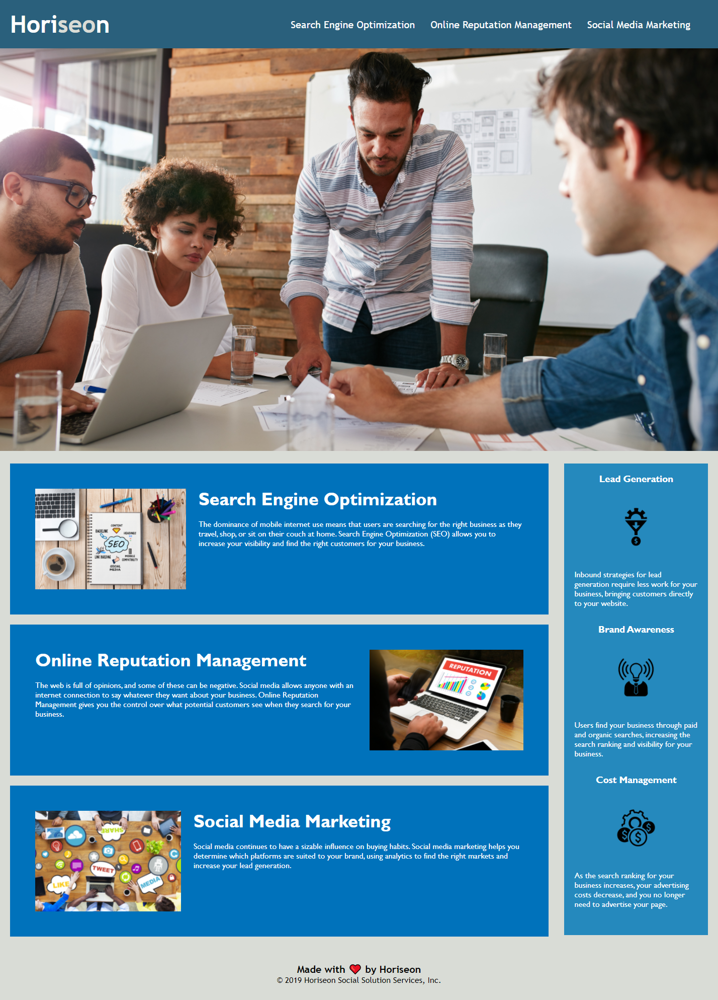

# Horiseon-SEO-Refactor

## Goal
Refactoring Horiseon SEO source code for accessibility. 

## Website URL
https://daman29.github.io/Horiseon-SEO-Refactor/

Link above takes you to the website.

## Description

- Refactored Horiseon SEO website.
- Cleaned up CSS elements.
- Non-semantic elements replaced with semantic elements where possible in the source code.
- Source code changed to follow accessibility standards
- Alt text given to all images and icons where required
- All headings in order and descriptive title provided
- Comments added to CSS and responsive behavior added
- Fixed broken links
- Fixed text jumping all over the webpage with different viewport size.

## Horiseon Webpage Overview
Below is the screen capture of the webpage.

---

## Bonus
- Added responsive design to CSS
- Added hover attribute to nav elements for accessibility
- Made all text more legible